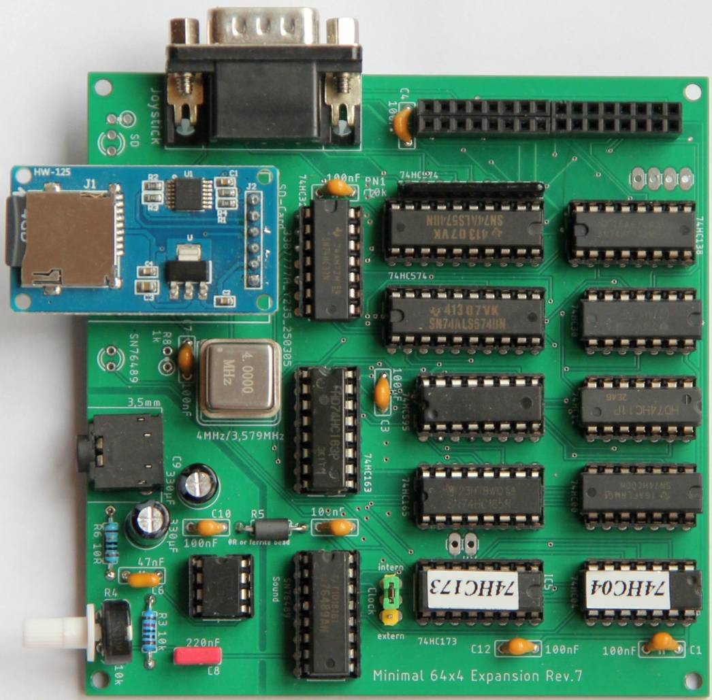
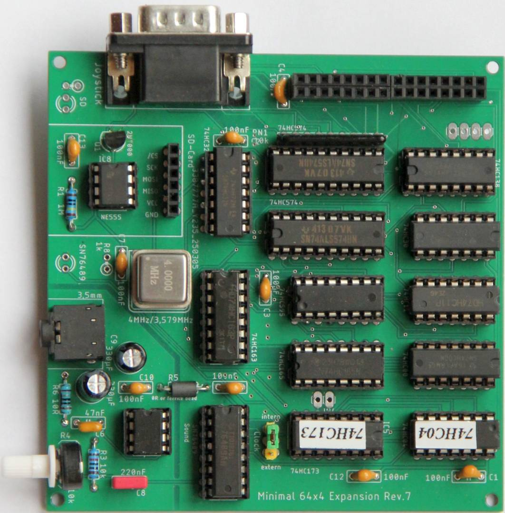

# Minimal-64x4 Expansion

Hardware extensions for the Minimal 64x4.

## Revision 6

Tested board:
https://github.com/hans61/Minimal-64x4-Expansion/tree/main/hardware/Rev.6

## Revision 7

Tested board:
https://github.com/hans61/Minimal-64x4-Expansion/tree/main/hardware/Rev.7

Revision 7 adds a Power ON Reset with NE555 to the board.

