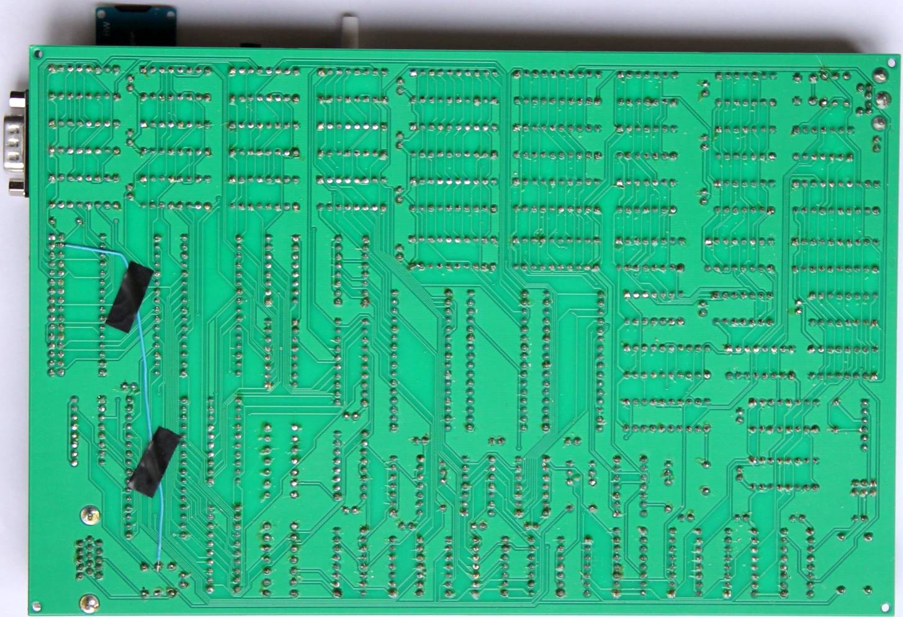

# Minimal-64x4 Expansion

Hardware extensions for the Minimal 64x4. This extension adds a Kempston joystick, sound output with the SN76489, an SD card interface and the query of the vsync signal for an exact time base to the Minimal64x4.

To use the vsync function you have to connect the vsync signal to the free pin on the expansion port.

## Revision 6

Tested board:
https://github.com/hans61/Minimal-64x4-Expansion/tree/main/hardware/Rev.6

## Revision 7

Tested board:
https://github.com/hans61/Minimal-64x4-Expansion/tree/main/hardware/Rev.7

Revision 7 adds a Power ON Reset with NE555 to the board.

