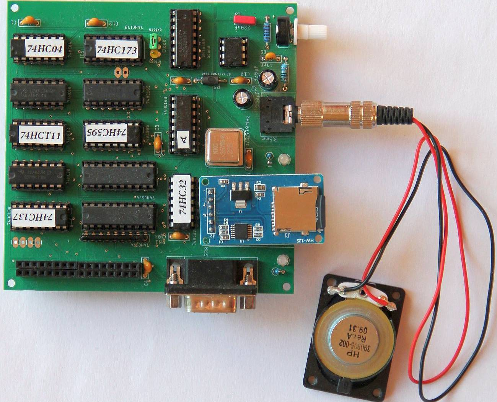
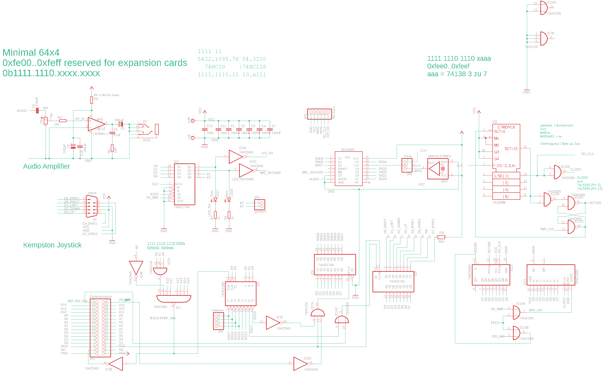

# Minimal-64x4 Expansion Rev.6

The previous revisions have a problem with controlling the /CS signals via the 74HC74. The problem only occurred in rare cases. On the new board I replaced the 74HC74 with a 74HC173. By including CLK the 74HC74 would have worked too. But that would have required more ICs.

The version supports Sound SN76489, a Kempston joystick port, an SD card interface and the query of the vsync signal. To query vsync, a connection must be made from R7 to the NC pin of the expansion port (between +5V and CLK).

Address decoding on the extension:
INH:     1111111011xxxxxx (0xFEC0..0xFEFF)
Decoder: 111111101110xyyy (0xFEE0..0xFEEF)
Addresses:
0xFEE0/0xFEE8 - 74HC574 (SN76489_D0..7, sound data)
0xFEE1/0xFEE9 - 74HC574 (Input Joystik & VSYNC)
0xFEE2/0xFEEA - 74HC173 (4x Output: CS SD card, CS SN76489, reserve, reserve)
0xFEE3/0xFEEB - 74HC595+74HC165 (SPI IN/OUT SD card)
0xFEE4/0xFEEC - reserve
0xFEE5/0xFEED - reserve
0xFEE6/0xFEEE - reserve
0xFEE7/0xFEEF - reserve

